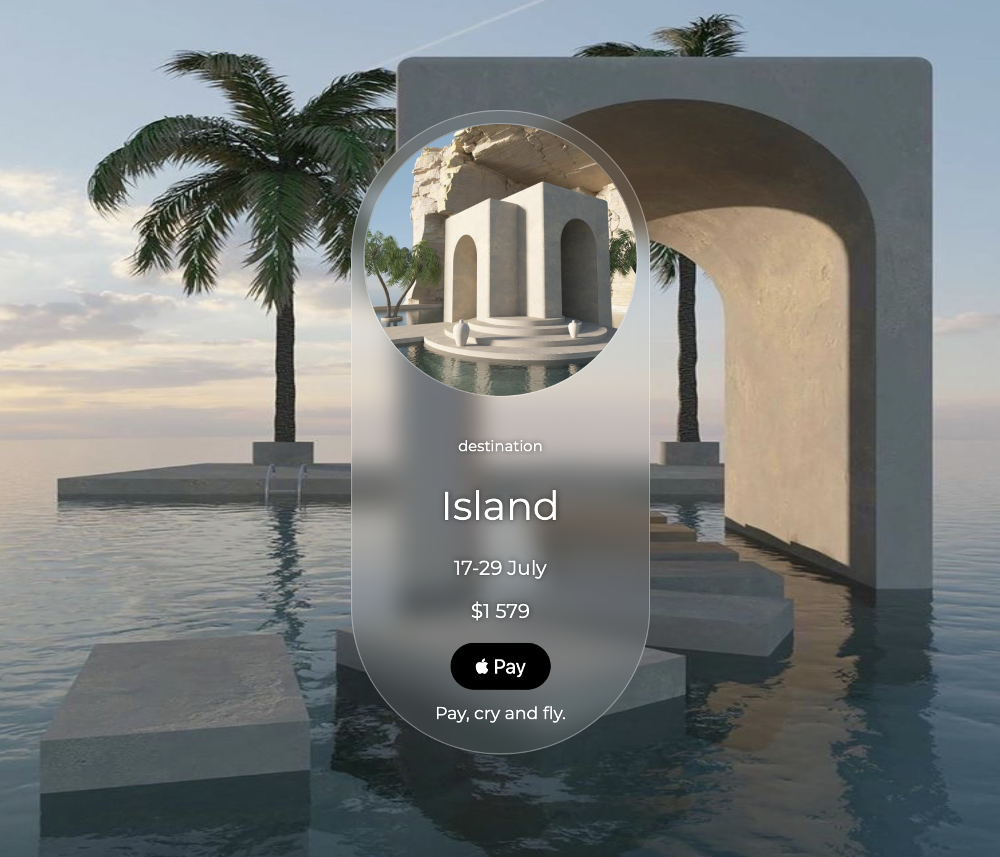

# Destination Page
A minimal concept travel card page built with **HTML** and **CSS** — inspired by modern UI designs from Pinterest.
This page visually represents a travel destination card with elegant gradients, glassmorphism, and clean typography.
# Introduction
This project showcases a static destination page concept, designed to mimic premium travel booking interfaces.
Although it doesn’t include any interactivity yet, it focuses on **layout**, **composition**, and **visual balance** — combining modern CSS effects.  

Created as a practice project to improve front-end design and CSS styling skills.
# Screenshot

  

 

# Installation for Users
You don’t need to install anything — the app is available online!

Visit the live site here:  
https://tasya1711.github.io/destination/  

Enjoy exploring the design
# Installation for Developers
If you’d like to experiment or extend the project locally:  
git clone https://github.com/Tasya1711/destination.git  
cd Destination  

Then simply open index.html in your browser.
